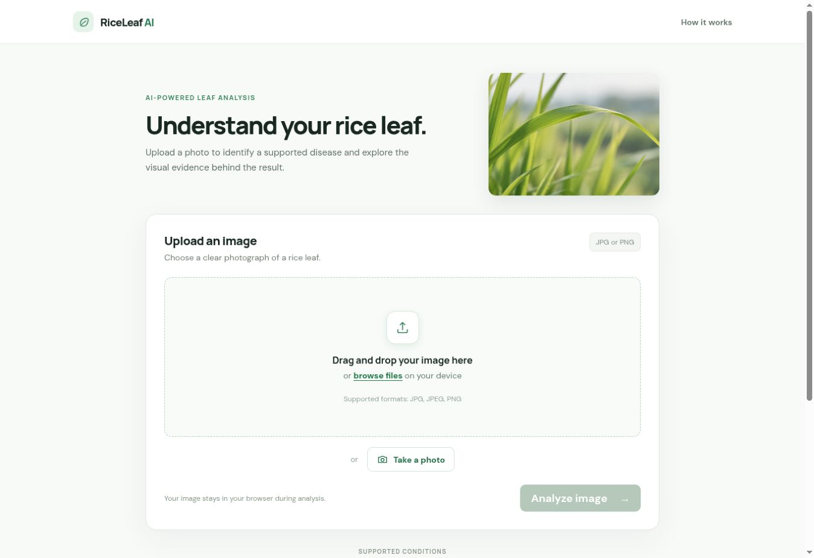
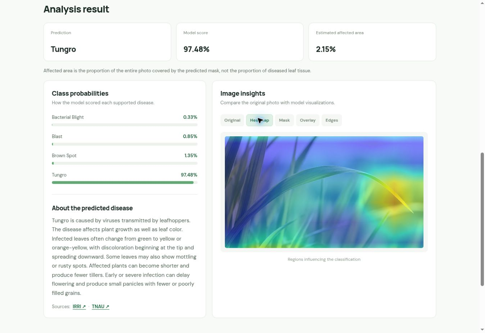
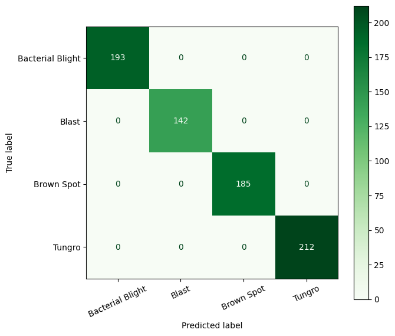
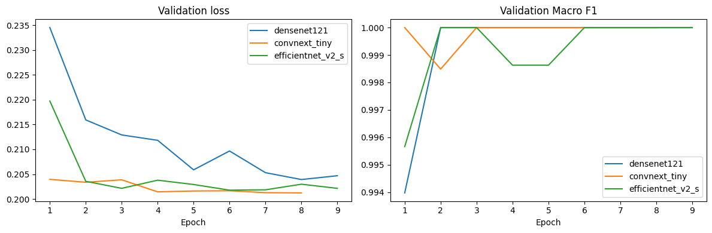
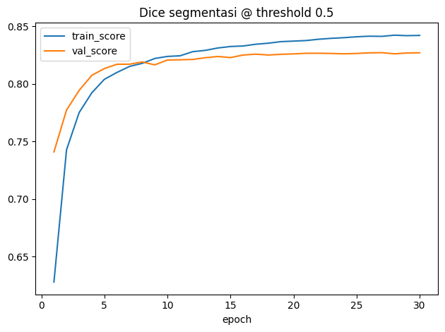

# RiceLeaf AI

RiceLeaf AI identifies four rice leaf diseases and visualizes the areas associated with each prediction. It combines a DenseNet121 classifier with a U-Net++ segmentation model in a responsive web application that runs inference directly in the browser.

**[Try RiceLeaf AI](https://riceleaf.wawutriambodo.my.id/)** · **[Training notebook](notebooks/RiceLeaf.ipynb)**



## Features

- Upload JPG or PNG images, drag and drop a photo, or capture one with a camera.
- Compare probabilities for Bacterial Blight, Blast, Brown Spot, and Tungro.
- Explore the original image, activation heatmap, predicted mask, overlay, and edges.
- Review low-confidence predictions using the threshold selected during validation.
- Track model download progress and receive specific feedback when an operation fails.
- Analyze images locally in the browser; photos are not uploaded for inference.

Affected area measures the percentage of the **entire image** covered by the predicted mask. It does not measure the percentage of diseased leaf tissue or disease severity.



## Models and inference

| Component | Implementation |
| --- | --- |
| Classification | DenseNet121, selected from DenseNet121, ConvNeXt-Tiny, and EfficientNetV2-S |
| Segmentation | U-Net++ with a ResNet34 encoder |
| Input | 320 × 320 pixels, letterbox padding and ImageNet normalization |
| Segmentation threshold | 0.40, selected on validation data |
| Confidence review threshold | Approximately 84.6%, stored in model metadata |
| Browser runtime | ONNX Runtime Web with WebAssembly |

The notebook fine-tunes ImageNet-pretrained networks and evaluates the PyTorch models. The web application uses exported ONNX models with the same input size, normalization, padding color, class order, temperature, and decision thresholds. Browser and Pillow image resizing can produce small numerical differences.

The notebook computes Grad-CAM++ with PyTorch autograd. The browser computes an activation heatmap from exported feature maps and classifier weights using a Grad-CAM++-style weighting approximation. It is displayed as **Heatmap** and should not be interpreted as pixel-identical to the notebook visualization. The web edge view filters Canny edges using the predicted mask; the original notebook example displays all image edges.

Model configuration is stored in [metadata](models/metadata.json). The [model manifest](models/manifest.json) records the size and SHA-256 checksum of every model chunk; the application validates these before initializing the models.

## Data and training

The project uses two public datasets:

- [Rice Leaf Disease Image Samples, Mendeley Data v2](https://doi.org/10.17632/fwcj7stb8r.2) for classification.
- [RiceSeg-5932, Mendeley Data v1](https://doi.org/10.17632/92jc6w6mcy.1) for segmentation.

Data preparation checks image integrity, corrects EXIF orientation, removes exact duplicates, and groups similar images using perceptual hashes. Group-based splitting reduces overlap between training, validation, and test images.

| Class | Images after deduplication |
| --- | ---: |
| Bacterial Blight | 1,284 |
| Blast | 960 |
| Brown Spot | 1,200 |
| Tungro | 1,308 |
| **Total** | **4,752** |

Training uses AdamW with an initial learning rate of 0.0001, cosine scheduling, batch size 8, gradient accumulation 2, up to 30 epochs, early-stopping patience 7, and seed 42. Augmentations include flips, small rotations, brightness, contrast, and saturation changes. Classification uses cross-entropy with label smoothing 0.05; segmentation uses binary cross-entropy and Dice loss. Mixed precision and gradient clipping are enabled.

StratifiedGroupKFold uses 20 folds: three for testing, three for validation, and the remainder for training. Checkpoints are selected by validation Macro F1 or Dice. Image-mask pairs are audited for dimensions, grayscale encoding, and mask polarity before segmentation training.

## Evaluation

These results come from the saved **internal test experiment**. No external labeled evaluation has been completed.

| Metric | Result |
| --- | ---: |
| Training / validation / test images | 3,283 / 737 / 732 |
| Selected classifier | DenseNet121 |
| Test accuracy | 100% |
| Test Macro F1 | 1.00 |
| Mean segmentation Dice | 0.8160 |
| Mean segmentation IoU | 0.6995 |

All three classifier candidates achieved validation Macro F1 of 1.00. DenseNet121 was the first candidate selected in this tie; the experiment does not establish that it outperforms the other candidates. Temperature scaling was skipped because all validation predictions were correct, leaving `temperature=1.0`.





The classifier curves show validation loss and validation Macro F1. The segmentation learning curves use threshold 0.5 during training; final evaluation uses threshold 0.40 and excludes letterbox padding.



| Class | Mean Dice | Mean IoU |
| --- | ---: | ---: |
| Bacterial Blight | 0.855563 | 0.753300 |
| Blast | 0.801743 | 0.682535 |
| Brown Spot | 0.815692 | 0.698814 |
| Tungro | 0.789812 | 0.662569 |

[Metric summary](results/metrics/test_summary.json) · [Classification report](results/metrics/classification_report.csv) · [Segmentation metrics](results/metrics/segmentation_by_class.csv) · [Split counts](results/metrics/split_counts.csv)

The notebook retains the original experiment outputs. Similar-image grouping reduces potential leakage but cannot guarantee separation of every image from the same plant or capture session. Internal accuracy should not be treated as expected field performance.

## Run locally

```bash
git clone https://github.com/UWWAWWU/RiceLeaf.git
cd RiceLeaf
python -m http.server 8000
```

Open `http://localhost:8000`. The first analysis loads approximately 133 MB of models plus the WebAssembly runtime. Download and initialization time depend on the connection and device. Camera capture requires permission and HTTPS or localhost.

To reproduce training, open [RiceLeaf.ipynb](notebooks/RiceLeaf.ipynb) in Google Colab with a GPU. Place the dataset archives in `MyDrive/RiceLeaf/data/`, run the cells in order, and confirm the image-mask audit. Use a new experiment name when changing the configuration.

## Repository guide

| Location | Contents |
| --- | --- |
| `index.html`, `style.css` | Responsive application interface |
| `app.js` | Model loading, inference, and visualizations |
| `models/` | ONNX model chunks, metadata, and integrity manifest |
| `runtime/` | ONNX Runtime Web and license notice |
| `notebooks/` | Training and evaluation code with experiment outputs |
| `results/` | Evaluation plots and machine-readable metrics |
| `images/` | Interface assets and application preview |
| `vercel.json` | Static hosting configuration |

## Scope and attribution

The models support four disease classes. They do not include a healthy-leaf class or a dedicated detector for unrelated images. The segmentation mask is a model prediction; the activation heatmap indicates classifier attention. This project demonstrates image analysis and does not replace an agricultural expert's assessment.

The datasets are published under CC BY 4.0 on their source pages. Retain dataset attribution and observe the terms of pretrained components when reusing the work. ONNX Runtime Web is distributed under the MIT license; its notice is included in [runtime/LICENSE](runtime/LICENSE).
